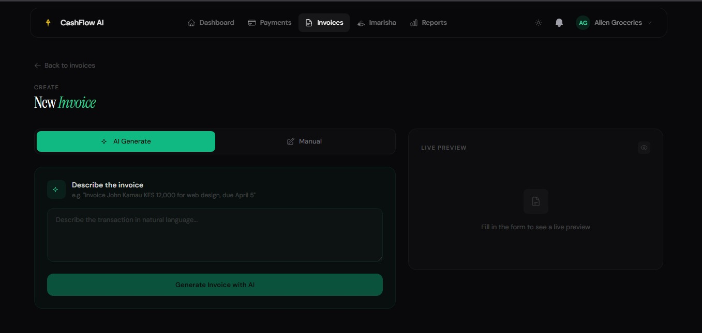
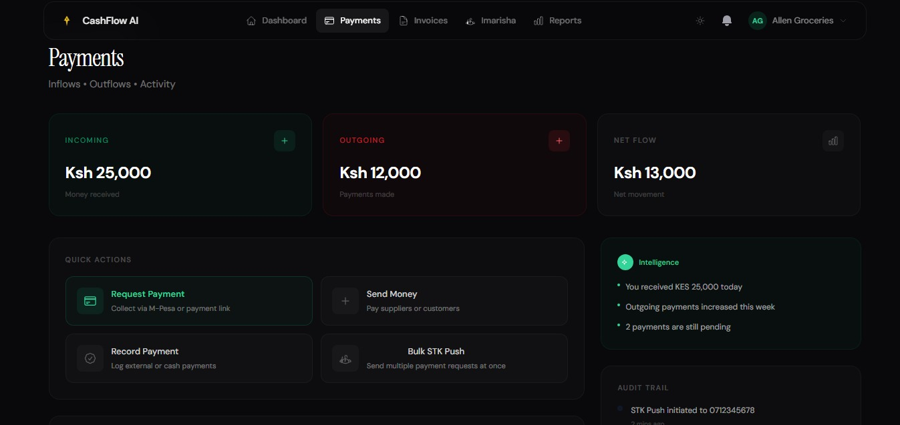

# CashFlow AI — Intelligent Business Payment Orchestration

An AI-powered cash flow management platform that helps SMEs automate their entire cash flow cycle — from invoice generation to payment collection to reconciliation — using Claude AI and M-Pesa.

## Problem Statement

African Small and Medium Enterprises (SMEs) face a critical cash flow management crisis:
- **60%** struggle with late payments extending to 45-60 days
- **70%** still use manual invoicing processes consuming 15-20 hours weekly
- **40%** cannot scale due to cash flow constraints
- **8-12%** annual revenue lost due to payment delays
- Fragmented financial systems with no real-time visibility

**Core Value Proposition:** "An intelligent tool built to request payments, collect via M-Pesa, and track every shilling in real time. Built for African Business."

## Screenshots

### Dashboard - Real-time Cash Flow Overview


### AI Invoice Generation


### Payment Request & Collection


### Smart Reminders Automation


## Live Demo

**Live:** [https://flowai.cash](https://flowai.cash)

### Test Account
- Email: `tomsteve187@gmail.com`
- Password: `gKe7Kbaf2WJyRRC`

## Architecture

```
┌─────────────────┐     ┌──────────────────┐     ┌──────────────────────┐
│  SvelteKit UI   │────▶│   FastAPI API    │────▶│  External Services   │
│  (port 9999)    │◀────│   (port 8888)    │◀────│  M-Pesa / Ratiba /   │
│                 │     │                  │     │  Claude AI           │
└─────────────────┘     └──────────────────┘     └──────────────────────┘
                                  │
                            ┌─────┴──────┐
                            │ PostgreSQL │
                            │  + Redis   │
                            └────────────┘
```

## Quick Start (Docker)

```bash
# Clone the repo
git clone https://github.com/FestFiti/cashflow-ai.git
cd cashflow-ai

# Copy environment files
cp backend/.env.example backend/.env

# Start everything
docker compose up --build
```

- Frontend: http://localhost:9999
- Backend API: http://localhost:8888
- API Docs: http://localhost:8888/docs

## Quick Start (Local Development)

**Backend**
```bash
cd backend
python3 -m venv venv
source venv/bin/activate
pip install -r requirements.txt
alembic upgrade head
uvicorn app.main:app --host 0.0.0.0 --port 8888 --reload
```

**Frontend**
```bash
cd frontend
npm install
npm run dev -- --port 9999
```

## Project Structure

```
cashflow-ai/
├── backend/                  # FastAPI backend (port 8888)
│   ├── app/
│   │   ├── main.py           # App entrypoint, CORS, middleware
│   │   ├── config.py         # Settings via pydantic-settings
│   │   ├── database.py       # SQLAlchemy async engine + session
│   │   ├── models/           # SQLAlchemy ORM models
│   │   ├── schemas/          # Pydantic request/response schemas
│   │   ├── routers/          # API route handlers
│   │   ├── services/         # Business logic (M-Pesa, Claude, etc.)
│   │   └── utils/            # JWT helpers, Redis client
│   ├── alembic/              # Database migrations
│   ├── templates/            # Jinja2 templates (invoice PDFs)
│   ├── tests/                # pytest test suite
│   ├── Dockerfile
│   └── requirements.txt
├── frontend/                 # SvelteKit frontend (port 9999)
│   ├── src/
│   │   ├── routes/           # SvelteKit pages
│   │   ├── lib/              # Shared code, stores, components
│   │   └── app.html
│   ├── Dockerfile
│   └── package.json
├── docker-compose.yml        # One-command full stack
├── PLAN.md                   # Build phases & milestones
└── README.md
```

## Core Features

| Feature | Description |
|---------|-------------|
| **Smart Invoice Generator** | Describe a transaction in plain language → AI generates a professional invoice |
| **M-Pesa STK Push** | Auto-generate payment links tied to invoices |
| **Reminder Scheduler** | AI determines optimal timing and drafts personalised reminders via Ratiba |
| **Cash Flow Forecasting** | AI predicts payment gaps based on historical patterns |
| **Reconciliation Bot** | Auto-matches M-Pesa confirmations to open invoices |
| **Dashboard** | Real-time view of receivables, payables, and cash flow trends |
| **Imarisha (Groups/Chama)** | Contribution tracking and disbursement automation |

## API Integrations

- **M-Pesa Daraja API** — STK Push, B2C, C2B, Transaction Status, Reversals
- **Ratiba API** — Scheduled reminders, recurring invoices, webhook callbacks
- **Claude AI** — Invoice generation, reminder drafting, cash flow insights
- **eSMS Mail API** — Transactional email (login alerts, password reset, invoices)

## Tech Stack

- **Frontend:** SvelteKit + TypeScript + TailwindCSS
- **Backend:** Python 3.12+ / FastAPI (async)
- **Database:** PostgreSQL (asyncpg) + Redis (caching/sessions)
- **AI:** Claude API (Anthropic)
- **Payments:** M-Pesa Daraja API
- **Scheduling:** Ratiba API
- **Containerization:** Docker + Docker Compose

## Environment Variables

See `backend/.env.example` for all required configuration.

## Team

| Name | Role |
|------|------|
| **Beth Kimani** | AI/ML Engineer — Claude integration, NLP, cash flow forecasting |
| **Oliver Jackson** | Cyber Security Analyst — Auth, encryption, compliance |
| **Osborne Nyakaru** | AI/ML Engineer — Invoice generation, anomaly detection |
| **Stanley Onyango** | Software Engineer — FastAPI backend, M-Pesa integration, DB design |
| **Steve Tom** | Software Developer — SvelteKit frontend, UI/UX, real-time dashboard |

## Target Market

- **Primary:** Kenyan SMEs (1.5 million registered businesses)
- **Secondary:** East African expansion (Tanzania, Uganda, Rwanda)

## Repository

- **URL:** https://github.com/FestFiti/cashflow-ai
- **License:** MIT

---

*Built for African businesses by the CashFlow AI team*
